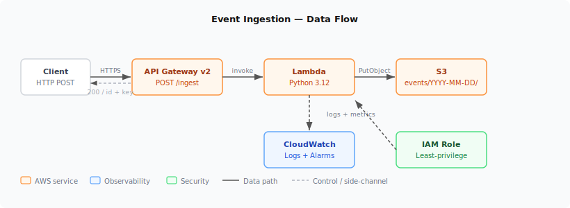
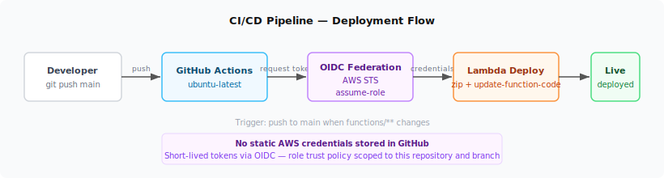

# portfolio-aws-platform

A serverless event ingestion pipeline built on AWS, fully managed with Terraform and deployed via GitHub Actions with OIDC authentication. Built as a portfolio project targeting DevOps and platform engineering roles.

---

## Overview

The pipeline accepts an HTTP POST request, validates the JSON body, enriches it with a UUID and UTC timestamp, and writes a structured object to S3 under a date-partitioned key. Every AWS resource is provisioned by Terraform with remote state, tagged for compliance, and deployed automatically through GitHub Actions — no static credentials anywhere.

---

## Architecture



| Component | Role |
| --- | --- |
| **API Gateway v2** | Public HTTPS endpoint — `POST /ingest`. Routes requests to Lambda via AWS proxy integration. |
| **Lambda (Python 3.12)** | Validates the request body, assigns a UUID and ISO-8601 timestamp, writes the enriched payload to S3. |
| **S3** | Private data lake. Server-side encryption (AES-256), versioning enabled, public access blocked. Objects stored under `events/YYYY-MM-DD/<uuid>.json`. |
| **CloudWatch** | Log group with a 14-day retention policy. Error-rate alarm and duration alarm configured for the Lambda function. |
| **IAM** | Least-privilege Lambda execution role (S3 `PutObject` only on the target bucket). Separate GitHub Actions role trusted via OIDC — no long-lived keys. |

---

## CI/CD Pipeline



The GitHub Actions workflow triggers on any push to `main` that touches `functions/**`. It uses OIDC federation to exchange a short-lived GitHub token for temporary AWS credentials — no secrets stored in GitHub.

**Steps:**

1. Checkout the repository.
2. Authenticate to AWS via `aws-actions/configure-aws-credentials` using OIDC (`id-token: write` permission).
3. Package `ingest.py` into a zip archive.
4. Call `aws lambda update-function-code` to deploy the new artifact.

The IAM role trust policy is scoped to the specific repository and branch, so no other repository or actor can assume it.

---

## Infrastructure

All resources are managed by Terraform. Remote state is stored in S3 with DynamoDB locking to prevent concurrent applies.

```text
terraform/
  backend.tf           # S3 remote state + DynamoDB lock table
  main.tf              # Module composition
  variables.tf         # Input variables
  locals.tf            # Common tags
  versions.tf          # Required providers
  modules/
    storage/           # S3 bucket, versioning, encryption, public access block
    iam/               # Lambda execution role, S3 write policy, GitHub Actions OIDC role
    lambda/            # Lambda function, archive packaging
    apigateway/        # HTTP API, stage, integration, route, Lambda permission
    observability/     # CloudWatch log group, error alarm, duration alarm
```

**Module dependency order:** `storage` → `iam` → `lambda` → `apigateway` + `observability`

---

## Compliance Tagging

Every resource receives the following tags automatically via Terraform `default_tags`:

```hcl
Project     = "portfolio-platform"
Environment = "dev"
ManagedBy   = "terraform"
Owner       = "omar.atabany"
Region      = "eu-central-1"
Repository  = "github.com/omaratabany/portfolio-aws-platform"
```

---

## Usage

Send a JSON event to the public endpoint:

```bash
curl -X POST https://v9je9vt2xh.execute-api.eu-central-1.amazonaws.com/ingest \
  -H "Content-Type: application/json" \
  -d '{"source": "test", "message": "hello"}'
```

Successful response:

```json
{
  "id": "3f1a2b4c-...",
  "key": "events/2026-04-20/3f1a2b4c-....json"
}
```

The object stored in S3:

```json
{
  "id": "3f1a2b4c-...",
  "timestamp": "2026-04-20T14:32:01.123456+00:00",
  "data": { "source": "test", "message": "hello" }
}
```

Error responses:

| Status | Cause |
| --- | --- |
| `400` | Empty or missing request body |
| `500` | Unhandled exception (logged to CloudWatch) |

---

## What I Would Add Next

| Addition | Value |
| --- | --- |
| **Athena + Glue Data Catalog** | SQL queries over S3 events without loading data into a database |
| **API Gateway authorizer** | Restrict ingest endpoint to authenticated callers |
| **SQS dead-letter queue** | Capture and retry failed Lambda invocations |
| **CloudWatch dashboard** | Unified view of ingestion rate, error rate, and Lambda p99 duration |
| **OpenTelemetry tracing** | End-to-end trace from API Gateway through Lambda to S3 |

---

## Stack

- Terraform 1.14 — AWS Provider 5.x
- Python 3.12 — boto3
- GitHub Actions — OIDC (no static credentials)
- AWS: API Gateway v2, Lambda, S3, IAM, CloudWatch

---

## Cost

Approximately $0/month. All resources operate within AWS free tier limits under typical portfolio traffic.
